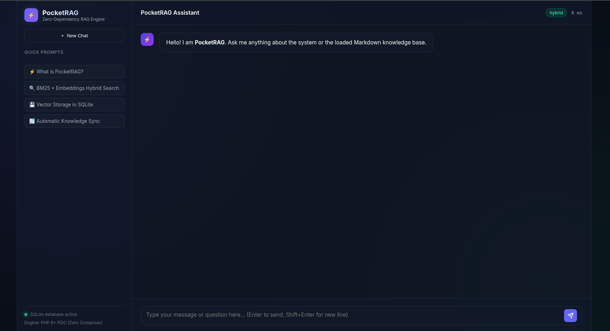
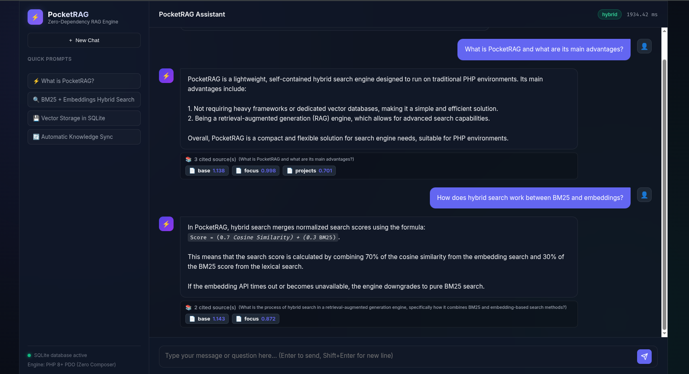
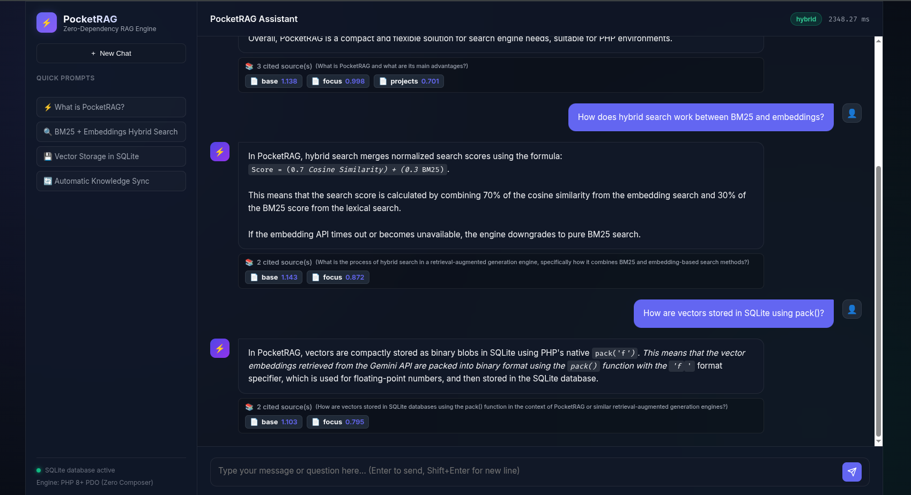

<div align="center">
  <h1>🐘 PocketRAG</h1>
  <p><strong>A zero-dependency, drop-in hybrid RAG engine for PHP.</strong></p>
  <p>Bring powerful vector search and conversational AI to any traditional PHP hosting using just SQLite—no heavy frameworks, Python stacks, or dedicated vector databases required.</p>

  <p>
    <a href="https://php.net"></a>
    <a href="#"></a>
    <a href="#"></a>
    <a href="https://github.com/devalexanderdaza/PocketRAG/blob/main/LICENSE"></a>
  </p>
</div>

---

## ⚡ Why PocketRAG?

Adding AI capabilities to legacy or lightweight PHP applications usually means standing up expensive Python servers, running Docker containers, and paying for dedicated vector databases like Pinecone or Qdrant. 

**PocketRAG solves this.** It is a pure PHP, self-contained AI search engine that runs anywhere PHP runs (including shared CPanel hosting). 

### ✨ Key Features
- **Zero Dependencies**: Uses only native PHP extensions (PDO SQLite). No `vendor/` bloat.
- **Hybrid Search**: Intelligently combines **Lexical Search** (native Okapi BM25 implementation) and **Vector Search** (Cosine Similarity on embeddings).
- **SQLite Vector Storage**: Stores and searches vector embeddings using a highly optimized C-binary packing (`pack('f*')`) inside standard SQLite.
- **Conversational Memory**: Automatically reformulates follow-up questions using the configured LLM provider to maintain chat context during retrieval.
- **Graceful Fallback**: If the embedding API times out or fails, PocketRAG transparently degrades to pure BM25 lexical search without breaking the app.
- **Auto-Sync**: Matches Markdown file modification times (`mtime`) and automatically triggers vector synchronization on the fly.
- **Built-in Web UI**: Lightweight, responsive dark-mode chat interface in `public/` ready to use out of the box with zero build steps.

## 🖥️ Web UI Preview

PocketRAG includes a zero-dependency, dark-mode Web UI out of the box. Simply visit `http://localhost:8080` in your browser when running the local PHP server.

<p align="center">
  
</p>

<p align="center">
  
</p>

<p align="center">
  
</p>

## 🚀 Installation & Setup

Because PocketRAG has zero dependencies, installation is just a matter of dropping the files into your project.

```bash
git clone https://github.com/devalexanderdaza/PocketRAG.git
cd PocketRAG
```

### 1. Configuration
Copy the example configuration file and add your API keys:

```bash
cp config.example.php config.php
```

Edit `config.php`:
```php
return [
    'groq_api_key'    => 'your_groq_api_key', // Used for LLM Completions & Reformulation
    'gemini_api_keys' => [
        'your_gemini_key_1', // Used for Embeddings. Supports automatic rotation!
    ],
    // ...
];
```

### 2. Add Knowledge
Drop your `.md` (Markdown) files into `data/knowledge/`. 
You can use YAML frontmatter to define priorities and tags:

```yaml
---
slug: my-document
title: System Architecture
tags: architecture, backend, php
priority: 8
---
Your markdown content here...
```

### 3. Sync & Run
PocketRAG can auto-sync on the fly, but for the initial load, you can run the ingestion pipeline:

```bash
php scripts/sync.php
```

## 🧠 How it Works

PocketRAG orchestrates search using a custom Hybrid Scoring formula:
> `Score = (0.7 * Normalized Cosine Similarity) + (0.3 * Normalized BM25)`

1. **User asks a question**.
2. **Context Reformulation**: If there's chat history, the configured LLM reformulates the query into a standalone sentence.
3. **BM25 Search**: The query is expanded using a bilingual synonym dictionary and run against a native PHP Okapi BM25 engine.
4. **Vector Search**: The query is embedded via Gemini API and compared against SQLite binary BLOBs using Cosine Similarity.
5. **LLM Generation**: The top results are injected into a prompt, and the configured LLM generates the final conversational response.

## 📡 API Usage

The main endpoint is `index.php`. It accepts `POST` JSON requests:

**Request:**
```json
{
  "message": "What is PocketRAG?",
  "history": [
    {"role": "user", "content": "Hello!"},
    {"role": "assistant", "content": "Hi! How can I help you?"}
  ]
}
```

**Response:**
```json
{
  "reply": "PocketRAG is a zero-dependency...",
  "search_query": "What is PocketRAG?",
  "sources": [
    {
      "id": "base-architecture",
      "label": "System Architecture",
      "snippet": "PocketRAG solves the problem of...",
      "score": 0.895
    }
  ],
  "mode": "hybrid",
  "fallback_occurred": false,
  "duration_ms": 1250
}
```

## 📚 Documentation

Full reference (architecture, components, pipeline, Auto-Sync, API, knowledge format, data model, configuration, ops, deploy, contributing):

**[docs/README.md](docs/README.md)** · **[Auto-Sync](docs/auto-sync.md)**

## 🤝 Contributing
Contributions, issues, and feature requests are welcome! See [docs/contributing.md](docs/contributing.md) and the [issues page](https://github.com/devalexanderdaza/PocketRAG/issues).

## 📄 License
This project is licensed under the MIT License - see the LICENSE file for details.

---
*Crafted with ❤️ for the PHP Community by [@devalexanderdaza](https://github.com/devalexanderdaza).*