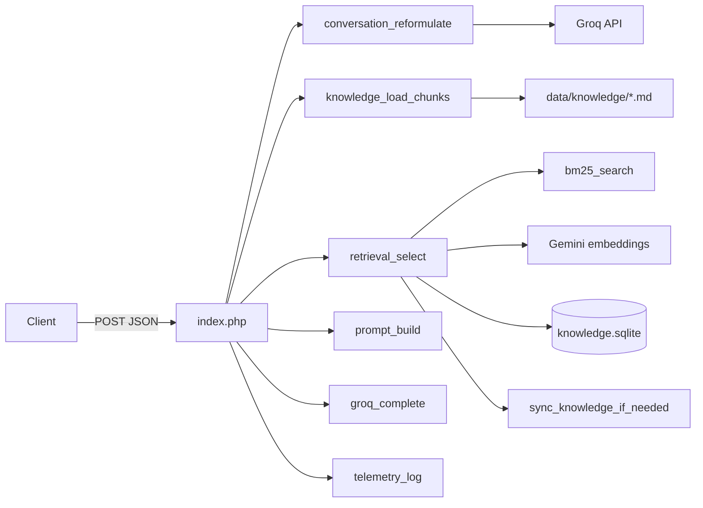

# Architecture

## What PocketRAG is

PocketRAG is a **zero-dependency hybrid RAG engine** for traditional PHP hosting. It answers questions over a Markdown knowledge base using:

1. **Lexical search** — Okapi BM25 implemented in pure PHP
2. **Vector search** — Gemini embeddings stored as binary BLOBs in SQLite, ranked with cosine similarity
3. **LLM generation** — Groq chat completions over retrieved context

It targets shared hosting (cPanel-style PHP + SQLite) where Composer, Docker, Python services, and dedicated vector DBs are impractical.

## Hard constraints

| Constraint | Implication |
|---|---|
| No Composer / `vendor/` / third-party PHP packages | Wire with `require_once`; module-prefixed globals (`bm25_`, `knowledge_`, …) |
| PHP 8+ with PDO SQLite and cURL | Host must enable `pdo_sqlite` and `curl` |
| Secrets stay local | `config.php` is gitignored; copy from `config.example.php` |
| Knowledge is Markdown files | Authoring is filesystem-based; SQLite holds embeddings + telemetry |

CI enforces the zero-deps rule via `.github/workflows/zero-deps.yml`.

## Logical layout

```text
index.php                 HTTP chat endpoint
scripts/sync.php          CLI ingestion
lib/                      Engine modules (no namespaces)
data/knowledge/*.md       Source of truth for content
data/knowledge.sqlite     Embeddings + telemetry (generated, not committed)
config.php                Local secrets (not committed)
```



## Design choices

### Hybrid scoring over pure vector or pure lexical

BM25 handles exact terms and bilingual synonym expansion well. Cosine similarity catches semantic paraphrases. The blend used at ranking time is:

```text
hybrid = 0.7 * normalized_cosine + 0.3 * normalized_bm25
```

Cosine is shifted from `[-1, 1]` to `[0, 1]` before mixing. If no query embedding or no vectors are available, ranking falls back to BM25 only (`mode: bm25_fallback`).

### SQLite BLOBs instead of a vector database

Vectors are stored with `pack('f*')` / `unpack('f*')` (`lib/math.php`). Magnitudes are precomputed at ingest so query-time cosine is a dot product over floats. This keeps the stack deployable as a single file database beside the Markdown sources.

### Auto-sync on freshness

Before vector search, `sync_knowledge_if_needed` compares Markdown `mtime` against the SQLite file `mtime`. If any `.md` is newer, it runs the same sync path as the CLI. Prefer an explicit `php scripts/sync.php` after bulk knowledge edits so the first chat request is not blocked by embedding work.

### Conversational reformulation

When history is present and Groq is configured, the latest user turn is rewritten into a standalone search query. Retrieval uses that query; the LLM completion still receives the original message plus history.

## Trust boundaries

| Boundary | Notes |
|---|---|
| Client → `index.php` | JSON body; CORS currently allows `*`; no auth in-tree |
| PocketRAG → Groq | Bearer token from `config.php`; used for reformulation + answer |
| PocketRAG → Gemini | API key query param; key pool rotates on HTTP 429/403 |
| Filesystem | Readable Markdown; writable `data/` for SQLite |

## Out of scope (current MVP)

- Multi-tenant isolation / auth
- Streaming SSE responses
- Automated PHP unit/integration test suite
- Namespaces / PSR-4 autoload
- Treating `foundation/` as architecture source of truth
