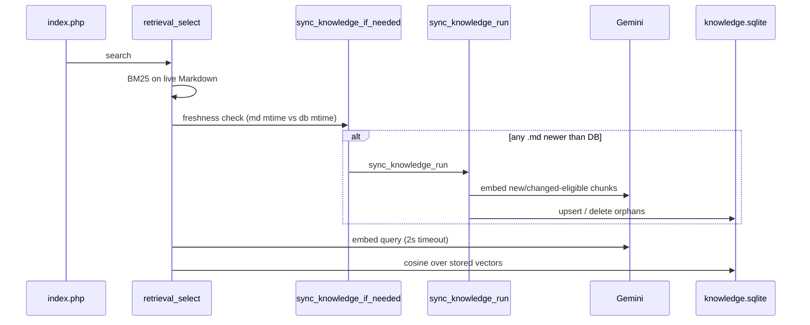

# Auto-Sync

Auto-Sync keeps the SQLite vector store aligned with Markdown under `data/knowledge/` **without requiring a separate admin request**. It runs inside hybrid retrieval, immediately before the query is embedded.

Feature name in the product README: **Auto-Sync** (freshness check on Markdown `mtime`).

## When it runs

Call site: `retrieval_select()` → `sync_knowledge_if_needed()` in `lib/sync.php`.

That path executes on every chat that reaches hybrid retrieval (i.e. normal `index.php` POSTs), not on a cron or webhook.

## Freshness rule

```text
needsSync = (SQLite file missing)
         OR (any data/knowledge/*.md has mtime > knowledge.sqlite mtime)
```

- Compares **file** modification times only (Markdown vs the DB file).
- Does **not** hash content, watch inotify, or scan subdirectories.
- Only top-level `*.md` files in `data/knowledge/` are considered (same as loaders).

If `needsSync` is false, retrieval continues with the existing DB (or BM25-only if there is no DB / no vectors).

## What runs when sync is needed

Auto-Sync calls the **same** core as the CLI:

```text
sync_knowledge_if_needed → sync_knowledge_run(..., verbose=false)
```

| Step | Behavior |
|---|---|
| Load | Chunk all `data/knowledge/*.md` via `knowledge_load_chunks` |
| Upsert | Embed + store chunks that need vectors |
| Skip | Existing row with **same** `embedding_model` and `dimensions` |
| Orphans | Delete DB rows whose chunk `id` no longer exists in Markdown |
| Errors | Caught and `error_log`'d — chat continues (may fall back to BM25) |

CLI equivalent (explicit, verbose):

```bash
php scripts/sync.php
```

## CLI sync vs Auto-Sync

| | CLI (`scripts/sync.php`) | Auto-Sync (inside chat) |
|---|---|---|
| Trigger | Operator runs it | Any Markdown newer than DB during retrieval |
| Output | Prints processed/skipped/deleted | Silent (`verbose=false`) |
| Embed timeout | `embeddings_get(..., 5)` seconds | Same `5` via `sync_knowledge_run` |
| Blocking | Blocks the shell | Blocks **that** HTTP request until sync finishes |
| Failure | Visible in terminal | Logged; request may still answer via BM25 |

Prefer CLI after bulk knowledge edits so the first user does not pay Gemini latency on a cold or dirty store.

## Sequence inside a chat request



Lexical BM25 always uses the **current** Markdown files in memory. Auto-Sync only refreshes the **vector** side of hybrid search.

## Limitations (current MVP)

1. **Chunk ID is position-based, not content-based** — The chunk id `{slug}#{position}` reflects the ordinal position
   of the chunk within the document body. If content is added or removed at the beginning of a file, subsequent
   chunk positions shift. Their `content_hash` will differ and they are re-embedded correctly, but orphaned
   old IDs from deleted positions are cleaned up as expected orphans. Skip logic: a chunk row is **skipped only
   when `content_hash`, `embedding_model`, AND `dimensions` all match** — content edits always trigger re-embedding.
2. **Coarse mtime** — editing a file then reverting content still can trip sync if `mtime` advanced; conversely, copying a file with an older `mtime` than the DB may not trigger sync.
3. **Request latency** — first chat after knowledge changes can be slow (N Gemini calls).
4. **No progress UI** — Auto-Sync has no HTTP status channel; clients only see total `duration_ms`.
5. **Requires Gemini keys** — without keys, sync cannot write new embeddings; hybrid mode may stay in `bm25_fallback`.

## Operational guidance

| Situation | Recommendation |
|---|---|
| Initial deploy / empty DB | Run `php scripts/sync.php` once |
| One-off Markdown tweak | Auto-Sync on next chat is enough *if* chunk ids are new or DB was cleared; otherwise prefer CLI + possible DB reset |
| Many files changed | Always CLI sync before opening traffic |
| Vectors look wrong vs Markdown | Delete `data/knowledge.sqlite*` → CLI sync |
| Shared hosting without SSH | Upload Markdown, hit chat once to trigger Auto-Sync, watch host error log and `duration_ms` |

## Code map

| Symbol | File | Role |
|---|---|---|
| `sync_knowledge_if_needed` | `lib/sync.php` | Freshness gate |
| `sync_knowledge_run` | `lib/sync.php` | Shared ingest implementation |
| Call from retrieval | `lib/retrieval.php` | Invoked before query embedding |
| CLI wrapper | `scripts/sync.php` | Operator entrypoint |

## Related docs

- [How it works](how-it-works.md) — full request pipeline
- [Knowledge base](knowledge.md) — Markdown layout and chunk ids
- [Operations](ops.md) — local verify and reset
- [Data model](data-model.md) — `knowledge_chunks` columns used for skip logic
