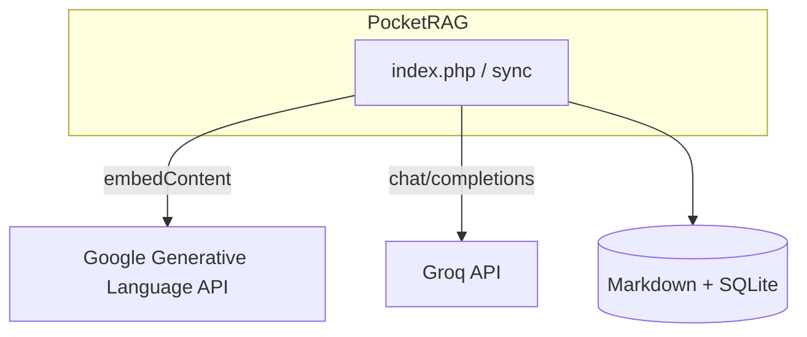

# Components

All library code lives under `lib/` as **prefixed global functions** (no namespaces, no Composer autoload). Entry points `require_once` the modules they need.

## Entrypoints

| Path | Role |
|---|---|
| `index.php` | Dual entrypoint: GET serves `public/index.html` & static assets (`public/assets/`); POST handles JSON chat RAG API (normalize history → reformulate → load knowledge → hybrid retrieve → prompt → LLM → telemetry → JSON) |
| `public/` | Web UI assets: `public/index.html`, `public/assets/css/chat.css`, `public/assets/js/chat.js`, `public/images/` |
| `scripts/sync.php` | CLI ingestion: Markdown → Gemini embeddings → SQLite |

## Library map

| Module | Prefix / symbols | Responsibility |
|---|---|---|
| `lib/http.php` | `http_` | Load config, CORS, POST gate, JSON body/response |
| `lib/conversation.php` | `conversation_` | History sanitize (last 10 user/assistant turns); query reformulation via Groq |
| `lib/knowledge.php` | `knowledge_` | Frontmatter parse, body chunking with overlap, chunk load, BM25 index build |
| `lib/bm25.php` | `bm25_` | Fold/tokenize, Okapi BM25 index + search (`k1=1.5`, `b=0.75`) |
| `lib/synonyms.php` | `synonyms_` | ES/EN word and phrase expansion before search |
| `lib/retrieval.php` | `retrieval_` | Hybrid orchestration, priority boost, citations, fallbacks |
| `lib/sync.php` | `sync_` | Shared ingest with `content_hash` diff + mtime freshness auto-sync |
| `lib/embeddings.php` | `embeddings_` | Gemini `embedContent` client with key rotation |
| `lib/math.php` | `vector_`, `cosine_` | `pack('f*')` / unpack, magnitude, cosine |
| `lib/db.php` | `db_` | PDO SQLite, WAL pragmas, schema bootstrap & migration |
| `lib/prompt.php` | `prompt_` | System prompt with retrieved context |
| `lib/llm.php` | `llm_` | Provider dispatcher (`groq`, `ollama`, `openai`) |
| `lib/groq.php` | `groq_` | Groq OpenAI-compatible chat completions with backoff retry |
| `lib/ollama.php` | `ollama_` | Ollama Local LLM chat completions |
| `lib/openai.php` | `openai_` | OpenAI chat completions |
| `lib/telemetry.php` | `telemetry_` | Insert / read `rag_telemetry` rows with toggle check |

## Constants that shape behavior

| Location | Constant | Value | Effect |
|---|---|---|---|
| `retrieval.php` | `RETRIEVAL_TOP_K` | `4` | Chunks injected into context |
| `retrieval.php` | `RETRIEVAL_CITATION_RATIO` | `0.35` | Citation score floor vs top hit |
| `retrieval.php` | `RETRIEVAL_MAX_CITATIONS` | `3` | Max `sources[]` entries |
| `knowledge.php` | `KNOWLEDGE_MIN_CHUNK_CHARS` | `320` | Prefer merging short paragraphs |
| `knowledge.php` | `KNOWLEDGE_MAX_CHUNK_CHARS` | `900` | Soft upper bound before sentence split |
| `embeddings.php` | `EMBEDDINGS_TIMEOUT_SECS` | `2` | Query-time embed timeout |
| `embeddings.php` | `EMBEDDINGS_SYNC_TIMEOUT_SECS` | `15` | Timeout for embedding calls during sync (`sync_knowledge_run`). |
| `groq.php` | `GROQ_TIMEOUT_SECS` | `20` | Completion HTTP timeout |
| `bm25.php` | `BM25_K1` / `BM25_B` | `1.5` / `0.75` | Classic Okapi parameters |

## Data & config surfaces

| Path | Tracked? | Notes |
|---|---|---|
| `data/knowledge/base.md` | Yes | Seed knowledge |
| `data/knowledge/*.md` (other) | No | Personal/domain docs — gitignored except `base.md` |
| `data/knowledge.sqlite*` | No | Generated DB + WAL sidecars |
| `config.example.php` | Yes | Template |
| `config.php` | No | Live secrets |
| `foundation/` | Ignored | Not product guidance |

## External services

- **Gemini** — embeddings only (`gemini-embedding-001`, default 768 dims)
- **Groq** — reformulation + final answer (default `llama-3.3-70b-versatile`)
