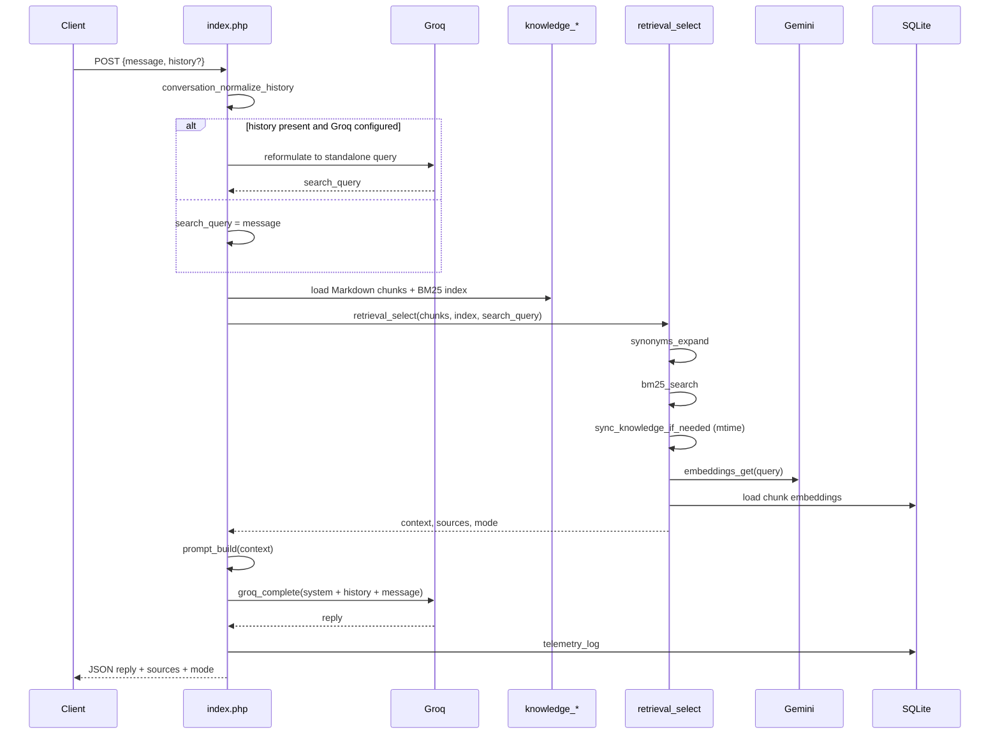

# How it works

This document walks one chat request from HTTP input to JSON response.

## Request pipeline

## Step detail

### 1. HTTP and message extraction

- Only `POST` (and CORS `OPTIONS` → 204).
- Body JSON: `message` required (or last `user` item in `history` / `messages` if `message` is empty).
- History aliases: `history` or `messages`. Normalized to `{role, content}` with roles `user` | `assistant`, max **10** turns.

### 2. Query reformulation

`conversation_reformulate_query` asks the configured LLM provider to produce a **standalone** search string when history exists. Failures fall back to the raw user message. The completion still uses the original `message`.

### 3. Knowledge load (every request)

`knowledge_load_chunks` reads `data/knowledge/*.md`, parses frontmatter, splits bodies into chunks with ids `{slug}#{position}`, then `knowledge_build_index` builds an in-memory BM25 index. Title and tags are folded into the first chunk of each slug for lexical signal.

### 4. Hybrid retrieval

1. Expand query with `synonyms_expand`.
2. Run BM25; keep positive scores; normalize by max BM25.
3. Freshness auto-sync if any Markdown `mtime` > DB `mtime`.
4. Embed expanded query (2s timeout, key rotation on 429/403).
5. For each stored chunk, cosine similarity with precomputed magnitudes; map to `[0,1]`.
6. Hybrid score `0.7 * cos + 0.3 * bm25`, or BM25-only if no cosine scores.
7. Priority boost: `score *= 1 + (priority - 5) * 0.05` (default priority `5`).
8. Take top **4** chunks for context. Citations: unique slugs, score ≥ `0.35 * topScore`, max **3**.
9. If nothing ranked, default to chunks with slug `profile` or `cv`, else first chunk.

### 5. Generation

`prompt_build` injects retrieved context into a fixed system prompt. Groq receives `[system, …history, user]`. Without a real Groq key, a mock reply is returned so retrieval can still be exercised.

### 6. Telemetry

Each successful path logs to `rag_telemetry`: original query, search query, mode, fallback flags, source count, duration ms.

## Modes

| `mode` | Meaning |
|---|---|
| `hybrid` | Query embedding succeeded and cosine scores were produced |
| `bm25_fallback` | No cosine scores — Gemini unavailable/timeout, or empty vector store |

`fallback_reason` when applicable: `Gemini API unavailable / timeout` or `No vectors in DB`.

## Sync behavior notes

See **[Auto-Sync](auto-sync.md)** for the full reference. Short version:

- **CLI** (`scripts/sync.php`): always runs `sync_knowledge_run` with verbose output.
- **Auto-Sync**: triggered by Markdown vs DB `mtime` only, inside `retrieval_select`.
- Within a sync run, a chunk is **skipped** if a row already exists with the **same** `embedding_model` and `dimensions` — content edits that keep the same chunk id may not re-embed until those fields change or the row is deleted. After material knowledge edits, delete `data/knowledge.sqlite*` or force a full re-ingest if vectors look stale.
